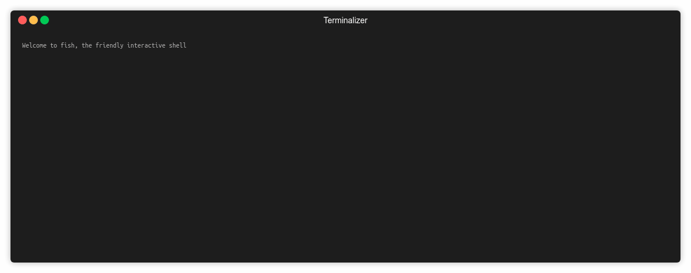

# ಠ_ಠ Where Is My Space



## Install

```bash
npm install -g wims
```

## Usage

```bash
wims [path]
```

# Options

- `-h, --help`

  - Displays this help message.

- `-d, --depth`

  - Depth to Scan (default: 1)

# Examples

```bash
 wims
```

```bash
 wims /dev
```

```bash
 wims -d 2 /dev
```
